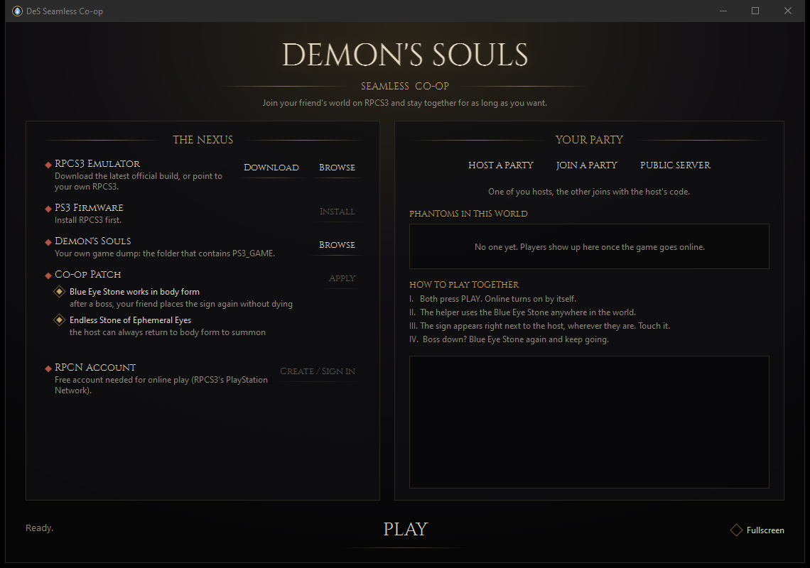

<p align="center"></p>

<h1 align="center">DeS Seamless Co-op</h1>
<p align="center"><b>Seamless co-op for Demon's Souls on RPCS3.</b><br>One of you hosts, the other pastes a code, and you play together for as long as you want.</p>

<p align="center"><a href="../../releases/latest"><b>⬇ Download the installer</b></a></p>

---

## Setup (once)

1. Run **`DesSeamlessCoop-Setup.exe`** and point it at your Demon's Souls folder.
   It downloads RPCS3 and the official PS3 firmware, patches the game and configures everything by itself.
   <p align="center"></p>
2. Open the app and create your free **RPCN** account (RPCS3's PlayStation Network). It's a small form, and a token arrives by email.

## Play

| Host | Friend |
|---|---|
| **Host a Party**, then **Copy** the code and send it | **Join a Party**, then paste the code and click **Join** |
| **PLAY** | **PLAY** |

In game, the helper uses the **Blue Eye Stone** anywhere. Their sign shows up **right next to the host, in whatever area the host is in**. Touch it and you're together.
After a boss, use the Blue Eye Stone again and keep going.

> Friend can't connect? The host's router has no UPnP (or is behind CGNAT). Install **Radmin VPN** (free) on both PCs, join the same network, and create the party again.

## What it does

- **Built-in party server.** It reimplements the Demon's Souls online server and runs inside the host's app, so there's no VPS to rent.
  - Blue signs from party members are **moved next to the host in any area**, using the positions the game itself reports.
  - No level range. US, EU and JP copies share one world. Messages, bloodstains and wandering ghosts all work.
  - A live list shows who is online, where they are, and who has a sign down or is in co-op.
- **Co-op patch** for your own dump. The originals are backed up and can be restored with one click.
  - The **Blue Eye Stone works in body form**, so nobody has to die to go back to helping.
  - The **Stone of Ephemeral Eyes is never consumed**, so the host can always get their body back to summon.
- **Automatic RPCS3 setup**: RPCN, server redirection, UPnP, skipping the intro videos and registering the game.
- **RPCN account creation inside the app**, with no digging through RPCS3's menus.
- **Dedicated server mode**: `DesCoop.exe --server --name "My Party"`, for a VPS or an always-on PC.
- **Public server**: one click to play on *The Archstones* with everyone.

## Limits

The game still ends the session when a boss dies or the host dies. That logic lives in the PS3 executable. This project turns rejoining into two clicks (Blue Eye Stone in body form, plus a sign that appears next to the host), but it doesn't prevent the disconnect.

## Build

```powershell
git clone --recursive https://github.com/himingal/des-seamless-coop
powershell -File tools/build-release.ps1 -Version 1.1.0   # tests + single-file exe + installer in dist/
```

## Credits

- Server protocol: [DeSSE](https://github.com/ymgve/desse) by ymgve and [dessego](https://github.com/danmrichards/dessego)
- [RPCS3](https://rpcs3.net) and [RPCN](https://github.com/RipleyTom/rpcn)
- [SoulsFormatsNEXT](https://github.com/soulsmods/SoulsFormatsNEXT) (GPL-3.0) and paramdefs from [Paramdex](https://github.com/soulsmods/Paramdex)
- [The Archstones](https://thearchstones.com)
- [Cinzel](https://github.com/NDISCOVER/Cinzel-Font) typeface (SIL OFL 1.1)

Fan project, not affiliated with FromSoftware, Bluepoint, Sony or the RPCS3 team. It ships no game files: use your own copy. Licensed under GPL-3.0.
