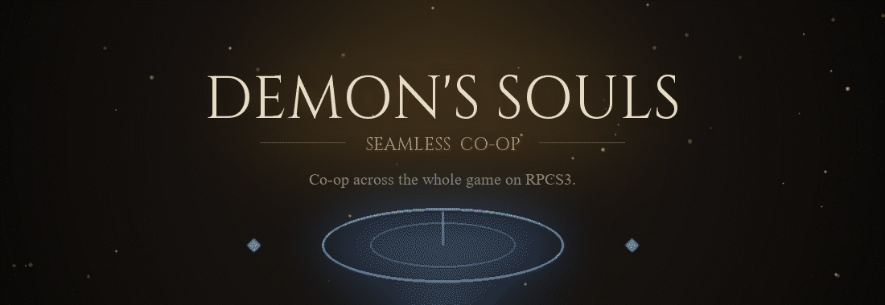
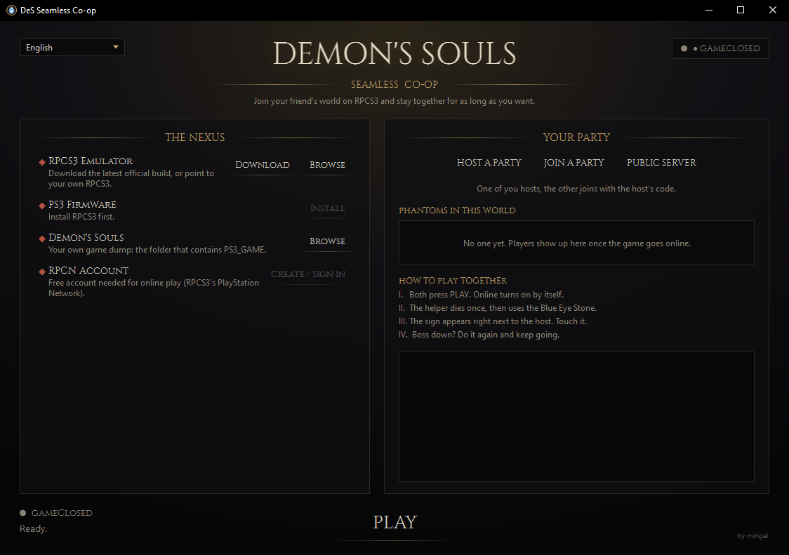
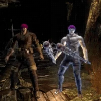
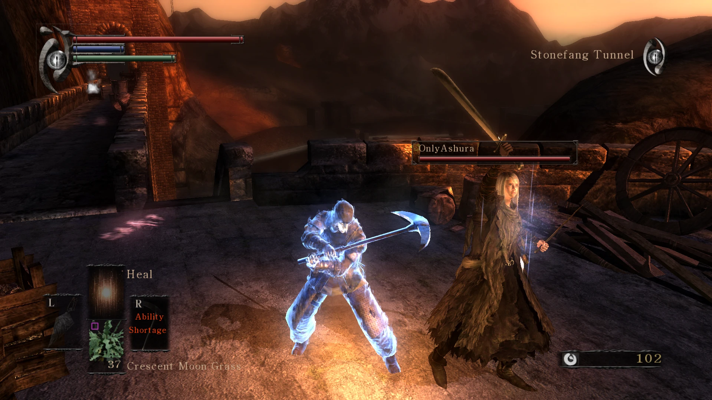
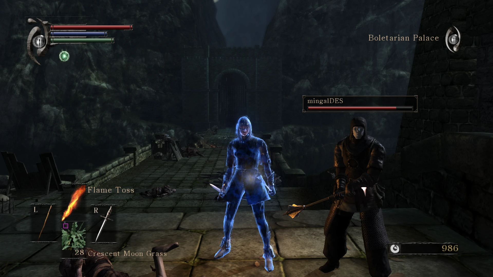
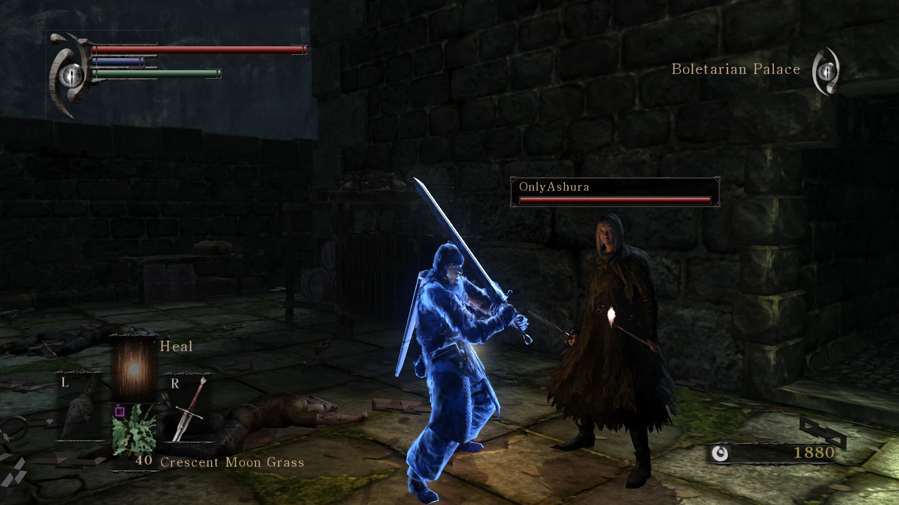

<p align="center">
  
</p>

<p align="center">
  <a href="https://github.com/himingal/des-seamless-coop/releases/latest"></a>
  
  
  
  
</p>

<p align="center">
  <b>Seamless co-op for Demon's Souls on <a href="https://rpcs3.net">RPCS3</a>.</b><br>
  One of you hosts, the other pastes a code, and you stay together for as long as you want — no VPN, no port forwarding, no router setup.
</p>

<p align="center">
  
</p>

Demon's Souls' online servers were shut down in 2018. This app brings co-op back on the [RPCS3](https://rpcs3.net) PS3 emulator: it reimplements the game's online server, runs it **inside the host's app**, and connects the two of you directly or through a free relay when your router won't cooperate. On top of that it moves your friend's summon sign **right next to you in any area**, so the two clicks of vanilla co-op become genuinely seamless.

> **You need your own Demon's Souls disc dump.** This project ships no game files — use the copy you own (`BLUS30443` / `BLES00932` / `BCJS30022`). Don't have it dumped yet? That part is on you, friend. 😉

## Co-op in action

<p align="center">
   &nbsp; 
</p>
<p align="center">
    
</p>

## Features

| | |
|---|---|
| 🌗 **Built-in party server** | The Demon's Souls online server, reimplemented and running inside the host's app. No VPS to rent, nothing to configure. |
| 🩸 **Signs that follow the host** | Your friend's blue summon sign is moved right next to you, in whatever area you're in — not left across the map. |
| ⚡ **Instant re-summon** | Sign relocated next to the host + a Cyanide Pill (turn ghost on demand) + infinite Ephemeral Eyes — so getting back together after a boss is two clicks, not a chore. |
| 🌍 **Join from anywhere** | Direct when it can (LAN, VPN, UPnP); otherwise through a free public relay, automatically. No port forwarding. |
| ♾️ **No level range** | US, EU and JP copies share one world. Messages, bloodstains and wandering ghosts all work. |
| ⚔️ **10 new starting classes** | Two per focus (Strength, Dexterity, Quality, Faith, Intelligence), unisex armor, ready-to-play kits. |
| 🛒 **Blacksmith carries the rarities** | Boldwin (in the Nexus) also sells the world-tendency-locked weapons, Colorless Demon's Souls and every Pure stone, so a co-op run never permanently misses them. |
| ☠️ **Cyanide Pill** | Every class starts with one (and Boldwin sells more): use it to die on the spot and turn into a soul-form ghost on demand, instead of farming a death to place a summon sign. |
| ✨ **Quality-of-life tweaks** | Full-HP soul form, infinite Ephemeral Eyes, passive MP regen, half-price merchants, faster upgrade stones and more — applied to your own dump, originals backed up. |
| 🎌 **Multi-language** | English, Português (BR) and Español. Detected on first run, switchable any time. |
| 🖱️ **Point-and-play setup** | Get [RPCS3](https://rpcs3.net) and point the app to it; it downloads the official PS3 firmware from Sony, patches the game and configures everything by itself. |

## Quick start

1. **Download and run** [`DesSeamlessCoop-Setup.exe`](https://github.com/himingal/des-seamless-coop/releases/latest) and point it at your Demon's Souls folder (the one that contains `PS3_GAME`).
   Then get [RPCS3](https://rpcs3.net/download) and point the app to its folder — the app downloads the official PS3 firmware, patches your game and configures everything.
2. **Open the app** and create your free **RPCN** account ([RPCS3's PlayStation Network](https://github.com/RipleyTom/rpcn)) — one small form, a token arrives by email.
3. Both of you press **PLAY**.

| Host | Friend |
|---|---|
| **Host a Party** → tell your friend the **party name + password** it shows | **Join a Party** → type that name + password, click **Join** |

## How to play together

1. Decide who leads the run — that player is the **host**.
2. The **helper** dies once to enter **soul form** (a ghost), then uses the **Blue Eye Stone** to place a blue sign.
3. The **host** stays human (a **Stone of Ephemeral Eyes** turns you back any time) and touches the sign — it appears **right next to you** — to summon the helper.
4. Play together. After a boss, do it again. Swap who hosts whenever you like.

The same how-to shows up in the game itself when you connect. A blue sign can only be placed in soul form — that's a rule of the PS3 game, not something the app can change.

## Limits

The game still ends the session when a boss or the host dies (that logic lives in the PS3 executable). This project makes rejoining fast — the sign appears next to the host, and you're never auto-reverted out of soul form — but it doesn't remove the disconnect. Boss kills and item pickups stay with whoever is the host, so alternate who hosts and the doubled loot evens out over a run.

## Build

```powershell
git clone --recursive https://github.com/himingal/des-seamless-coop
powershell -File tools/build-release.ps1 -Version 2.0.0   # tests + single-file exe + installer in dist/
```

.NET 10, WPF, a reimplemented server in a shared library, xUnit tests and an Inno Setup installer.

## Credits

- Server protocol: [DeSSE](https://github.com/ymgve/desse) by ymgve, and [dessego](https://github.com/danmrichards/dessego)
- [RPCS3](https://rpcs3.net) and [RPCN](https://github.com/RipleyTom/rpcn)
- [SoulsFormatsNEXT](https://github.com/soulsmods/SoulsFormatsNEXT) and paramdefs from [Paramdex](https://github.com/soulsmods/Paramdex)
- [The Archstones](https://thearchstones.com) public server
- [Cinzel](https://github.com/NDISCOVER/Cinzel-Font) typeface (SIL OFL 1.1)

<sub>Fan project, not affiliated with FromSoftware, Bluepoint, Sony or the RPCS3 team. It ships no game files: use your own copy. Licensed under GPL-3.0.</sub>
